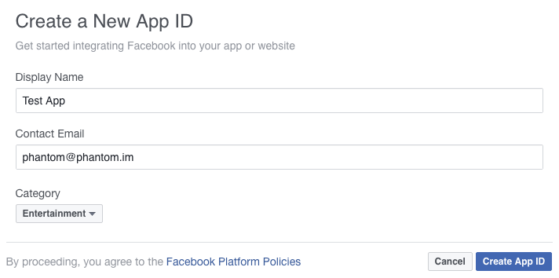

# Facebook

**ATTENTION: THIS GUIDE DOESN't WORK IN MOBILE DEVICES, PLEASE USE THE [FIREBASE FACEBOOK AUTH GUIDE](https://github.com/PhantomAppDevelopment/firebase-as3/tree/master/auth/facebook) INSTEAD**

Integrating Facebook API functionality in your application doesn't require external libraries.

## Getting Started

1. Register in the [Facebook Developer portal](https://developers.facebook.com/). You may be asked to provide a valid cell phone number to complete your registration.
  
2. Once registered, locate a drop-down list in the top right and click on it. At the middle it will be an option to `Add a New App`.
  
3. You will be presented with 4 options, select `Website` (even if you are developing an Android or iOS app). We can later add the other platforms when we are ready for deployment.

4. Click the button that says `Skip and Create App ID`. A form will appear where you have to provide your app details, once finished click the `Create App ID` button.



5. You will be redirected to your Dashboard, click the Get Started button next to the Facebook Login option.

6. You will be asked to `Choose a Platform`. Select `Other`.

7. Configure the OAuth settings similar to the next image. Set the redirect URI to: `https://www.facebook.com/connect/login_success.html` and press the Save Changes button.


8. Click Settings in the left side menu. You will be presented with a screen with your `App ID` and `App Secret`, you will be required to provide your Facebook password to see the `App Secret`.
9. Once authorized, copy down your `App ID` and `App Secret`. We are going to use them in a later step.

At this point the Facebook API will only work with your own Facebook Account, in order for it to work on any account you need to switch your app status from `development` to `public`.

8. If you are still in the `Dashboard` click the `App Review` option in the left side.

9. In the `Make [Your App Name] public?` section turn it to `Yes`. A pop-up will appear asking if you want to make your app public, click the `Confirm` button.

With these settings your app will only be allowed to do basic reading operations with the Facebook API. If you want to do writing operations such as `Liking` and `Posting` to the user wall you must submit your app for review.

## Implementation

Open or create a new project.

Open the file where you want to implement the Sign-In feature.

Add the following constants and variables:

```actionscript
private static const CLIENT_ID:String = "Your own Client ID";
private static const CLIENT_SECRET:String = "Your own Client Secret";
			
private var webView:StageWebView;
private var code:String;
private var access_token:String;
private var accessTokenLoader:URLLoader;
private var profileLoader:URLLoader;
```
Add a button and assign an `EventListener` to it when it gets pressed. The code of the EventListener should be as follows:

```actionscript
private function initSignIn():void
{
	webView = new StageWebView(true);
	webView.addEventListener(LocationChangeEvent.LOCATION_CHANGE, changeLocation);
	webView.stage = this.stage;
	webView.viewPort = new Rectangle(0, 0, stage.stageWidth, stage.stageHeight);
	webView.loadURL("https://www.facebook.com/dialog/oauth?client_id="+CLIENT_ID+"&redirect_uri=https://www.facebook.com/connect/login_success.html&scope=email");
}
```

We initialized a `StageWebView` instance, set its dimensions to match the stage size. We crafted a special URL that contains several parameters:

* scope: The permissions we require from the OAuth server, in this case we require the user email address.

* redirect_uri: We provided a special url from Facebook which will contain the response `code`.

* client_id: Your Client ID.

```actionscript
private function changeLocation(event:LocationChangeEvent):void
{
	var location:String = webView.location;

	if(location.indexOf("code=") != -1 && location.indexOf("error") == -1){
		webView.dispose();
		code = location.substr(location.indexOf("code=")+5, location.length);
		getAccessToken();
	}			
}
```

We start listening for a `LocationChange` event (every time the web browser changes its web page), once a web page contains the `code` parameter in its URL we dispose the StageWebView and extract the parameter to a variable.

Then we called a custom function `getAccessToken()` where we are going to create an `URLRequest` to exchange the `code` for an `access_token`.

```actionscript
private function getAccessToken():void
{				
	var request:URLRequest = new URLRequest("https://graph.facebook.com/v2.3/oauth/access_token?client_id="+CLIENT_ID+"&redirect_uri=https://www.facebook.com/connect/login_success.html&client_secret="+CLIENT_SECRET+"&code="+code);

	accessTokenLoader = new URLLoader();
	accessTokenLoader.addEventListener(Event.COMPLETE, accessTokenReceived);
	accessTokenLoader.load(request);
}
```

We sent all the parameters in a `GET` request and added an `EventListener` which will contain the `access_token`.

```actionscript
private function accessTokenReceived(event:Event):void
{				
	var rawData:Object = JSON.parse(String(event.currentTarget.data));
	access_token = rawData.access_token;
				
	loadProfileInfo();
}
```

We converted the response from the `URLRequest` into a `JSON` object and took the `access_token` value and set it into a String.

With the `access_token` we can connect to the [Facebook Graph API](https://developers.facebook.com/docs/graph-api) very easily, for example we are going to load the logged-in user profile information.


```actionscript
private function loadProfileInfo():void
{
	profileLoader = new URLLoader();
	profileLoader.addEventListener(Event.COMPLETE, profileLoaded);
	profileLoader.load(new URLRequest("https://graph.facebook.com/me/?access_token="+access_token+"&fields=name,email,picture.type(large)"));
}
			
private function profileLoaded(event:Event):void
{
	trace(event.currentTarget.data);
}
```

Note that we needed to specify which fields we need from the API, in this case we asked for the user `name`, `email` and `picture`.