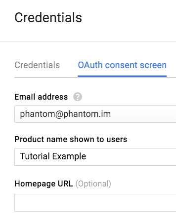
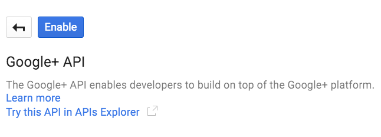

# Google

Integrating Google Accounts (Google+,Youtube, Google Apps) functionality in your application doesn't require external libraries.

## Getting Started

1. Register in the [Google Developer console](https://console.developers.google.com/). You may be asked to provide a valid telephone number to complete your registration.
  
2. Once registered, locate a drop-down list in the top and click on it. At the bottom it will be an option to Create a Project.
  
3. Type a name for your project and save it.

4. On the left side you will see a button with 3 lines, click it and then select API Manager.

5. Select Credentials and then click on the OAuth Consent Screen tab. Type a product name and save it.



6. Go to the Credentials tab, press the Create Credentials drop down list and select OAuth client ID. In Application Type select `Other`, type a name and save it.

7. A window will appear with your Client Id and Client Secret, copy them down and click Ok.

8. On the left side, click on Overview and a list of APIs will appear on the right. Search the Google+ API and click it.

9. Click the `Enable` button and wait until the API is enabled.



If you want to interact with other Google APIs in your application you will have to repeat the last two steps for each one.

## Implementation

Open or create a new project.

Open the file where you want to implement the Sign-In feature.

Add the following constants and variables:

```actionscript
private static const CLIENT_ID:String = "Your own Client ID";
private static const CLIENT_SECRET:String = "Your own Client Secret";
			
private var webView:StageWebView;			
private var code:String;
private var access_token:String;
private var accessTokenLoader:URLLoader;
private var profileLoader:URLLoader;
```
Add a button and assign an `EventListener` to it when it gets pressed. The code of the EventListener should be as follows:

```actionscript
private function windowedapplication1_applicationCompleteHandler(event:FlexEvent):void
{
	webView = new StageWebView(true);
	webView.addEventListener(LocationChangeEvent.LOCATION_CHANGE, changeLocation);
	webView.stage = this.stage;
	webView.viewPort = new Rectangle(0, 0, stage.stageWidth, stage.stageHeight);
	webView.loadURL("https://accounts.google.com/o/oauth2/v2/auth?scope=email%20profile&redirect_uri=urn:ietf:wg:oauth:2.0:oob:auto&response_type=code&client_id="+CLIENT_ID);
}
```

We initialized a StageWebView instance, set its dimensions to match the stage size. We crafted a special URL that contains several parameters:

* scope: The permissions we require from the OAuth server, in this case we require the user email address and their basic profile information.

*  redirect_uri: We provided a special string that tells OAuth we want a PIN-less authentication.

* response_type: We only require a `code` as a response.

* client_id: Your Client ID.

```actionscript
private function changeLocation(event:LocationChangeEvent):void
{
	var pageTitle:String = webView.title;
				
	if(pageTitle.indexOf("code=") != -1){
		webView.dispose();
		code = pageTitle.substr(pageTitle.indexOf("code=")+5, pageTitle.length);
					
		getAccessToken();
	}				
}
```

We start listening for a `LocationChange` event (every time the web browser changes its web page), once a web page contains the `code` parameter in its Title we dispose the StageWebView and extract the parameter to a variable.

Then we called a custom function `getAccessToken()` where we are going to create an `URLRequest` to exchange the `code` for an `access_token`.

```actionscript
private function getAccessToken():void
{				
	var urlVars:URLVariables = new URLVariables();
	urlVars.code = code;
	urlVars.client_id = CLIENT_ID;
	urlVars.client_secret = CLIENT_SECRET;
	urlVars.redirect_uri = "urn:ietf:wg:oauth:2.0:oob:auto";
	urlVars.grant_type = "authorization_code";
				
	var request:URLRequest = new URLRequest("https://www.googleapis.com/oauth2/v4/token");
	request.method = URLRequestMethod.POST;
	request.data = urlVars;
				
	accessTokenLoader = new URLLoader();
	accessTokenLoader.addEventListener(Event.COMPLETE, accessTokenReceived);
	accessTokenLoader.load(request);
}
```

We sent all the parameters in a `POST` request and added an `EventListener` which will contain the `access_token`.

```actionscript
private function accessTokenReceived(event:Event):void
{				
	var rawData:Object = JSON.parse(String(event.currentTarget.data));
	access_token = rawData.access_token;
				
	loadProfileInfo();
}
```

We converted the response from the URLRequest into a JSON object and took the `access_token` value and set it into a String.
With the `access_token` we can connect to the Google APIs very easily, for example we are going to load the logged-in user profile information.


```actionscript
private function loadProfileInfo():void
{
	profileLoader = new URLLoader();
	profileLoader.addEventListener(Event.COMPLETE, profileLoaded);
	profileLoader.load(new URLRequest("https://www.googleapis.com/plus/v1/people/me?access_token="+access_token));
}
			
private function profileLoaded(event:Event):void
{
	trace(event.currentTarget.data);
}
```

You can check a list of all Scopes in the [OAuth 2.0 Scopes for Google APIs.](https://developers.google.com/identity/protocols/googlescopes#plusv1)
Rememeber to Enable the corresponding APIs in the Google Developer Console.