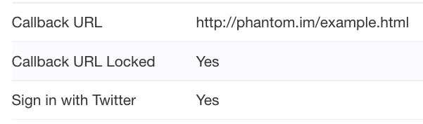

# Twitter

Integrating Twitter functionality in your application requires the following libraries:

  - A special version of [Twitter for AS3](https://github.com/susisu/Twitter-for-AS3) that supports PIN-less authorization (I included it for your convenience).
  - [AS3 Crypto.](http://crypto.hurlant.com/demo/as3crypto.swc)
  - An empty HTML file that can be reliable accessed over the internet.

## Getting Started

  1. Register in the [Twitter Developer portal](https://dev.twitter.com). You may be asked to provide a valid cellphone number to complete your registration.
  
  2. Once registered locate a button that says: 'Create New App' and click it.
  
  3. Fill all the fields as normally. Once you reach the Callback URL provide the URL of the empty html file you have hosted. For example: http://phantom.im/example.html

  4. Go to the Settings tab and make sure these two options are checked:
  - Enable Callback Locking (It is recommended to enable callback locking to ensure apps cannot overwrite the callback url)
  - Allow this application to be used to Sign in with Twitter

  5. Go to the 'Keys and Access Tokens' tab and copy down your Consumer Key and Consumer Secret.



## Implementation

Open or create a new project and import Twitter for AS3 and AS3 Crypto.

Open the file where you want to implement the Sign-In feature.

Add the following constants and variables:

```actionscript
private static const CONSUMER_KEY:String = "YOur Consumer Key";
private static const CONSUMER_SECRET:String = "Your Consumer Secret";
						
private var webView:StageWebView;
private var twitter:Twitter;
private var credentialsRequest:TwitterRequest;
```
Add a button and assign an event listener to it when it gets pressed. The code of the Event Listener should be as follows:

```actionscript
protected function buttonHandler():void
{
	twitter = new Twitter(CONSUMER_KEY, CONSUMER_SECRET);
				
	var rtRequest:TwitterRequest = twitter.oauth_requestToken("http://phantom.im/example.html");
	rtRequest.addEventListener(TwitterRequestEvent.COMPLETE, requestComplete);							
}
```

The URL must be the same as the one on the Twitter Developer portal. We now need to add the requestComplete function.

```actionscript
private function requestComplete(event:TwitterRequestEvent):void
{
	webView = new StageWebView(true);
	webView.stage = this.stage;
	webView.viewPort = new Rectangle(0, 0, this.stage.stageWidth, this.stage.stageHeight);
	webView.addEventListener(LocationChangeEvent.LOCATION_CHANGE, locationChange);
	webView.loadURL(twitter.getOAuthAuthorizeURL());
}
```

We initialized a StageWebView instance, set its dimensions to match the stage size and assign the URL provided by the Twitter API. Now we are going to retrieve a token located in the URL.

```actionscript
private function locationChange(event:LocationChangeEvent):void
{
	var url:String = webView.location;
	
	if(url.indexOf("oauth_verifier=") != -1){										
		webView.dispose();	
							
		var verifier:String = url.substr(url.indexOf("oauth_verifier=")+15, url.length);
					
		var atRequest:TwitterRequest = twitter.oauth_accessToken(verifier);
		atRequest.addEventListener(TwitterRequestEvent.COMPLETE, tokenComplete);
	}				
}
```

We start listening for a LocationChange event (every time the web browser changes its web page) once a web page contaings the oauth_verifier parameter we dispose the StageWebView and extract the parameter to a variable.

Now we are going to exchange the oauth_verifier for an access_token.

```actionscript
private function tokenComplete(event:TwitterRequestEvent):void
{
	credentialsRequest = twitter.account_verifyCredentials();
	credentialsRequest.addEventListener(TwitterRequestEvent.COMPLETE, credentialsComplete);
}
```

Our Access Token is saved in the TwitterTokenSet object and will be automatically be used in future requests to the API. In this case we call the account_verifyCredentialts method which returns detailed information of the logged in user.

```actionscript
private function credentialsComplete(event:TwitterRequestEvent):void
{
	trace(credentialsRequest.response);				
	var response:Object = JSON.parse(String(credentialsRequest.response));
}
```

We listen for the response and create an Object from it using the JSON parser. From there you can take the information you need.